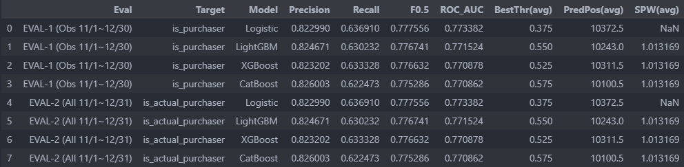
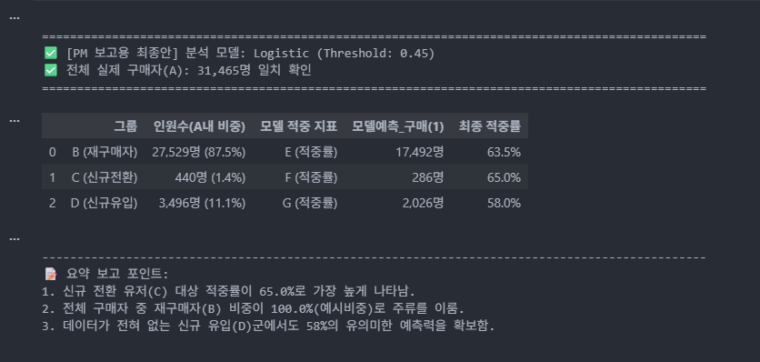
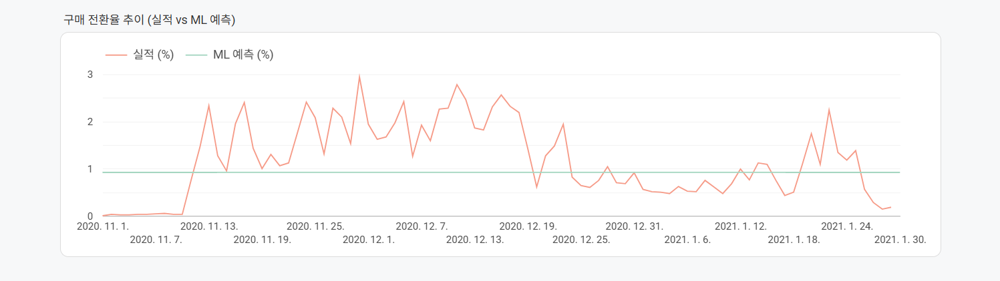
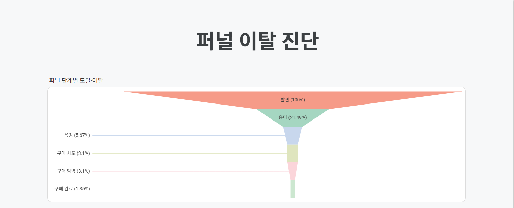
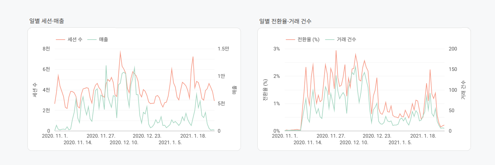
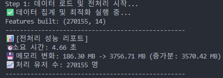
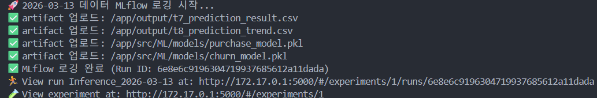
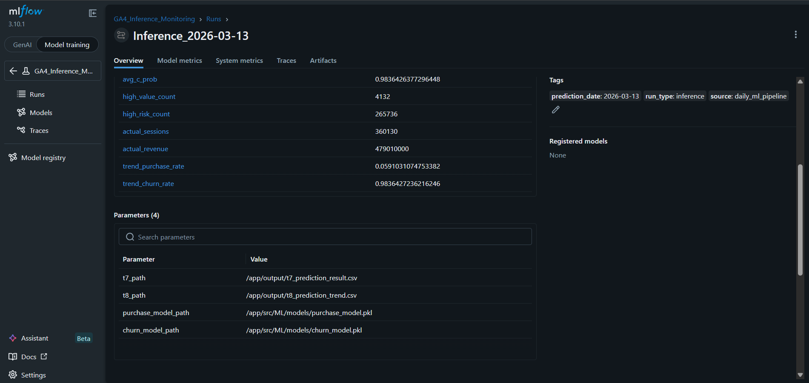
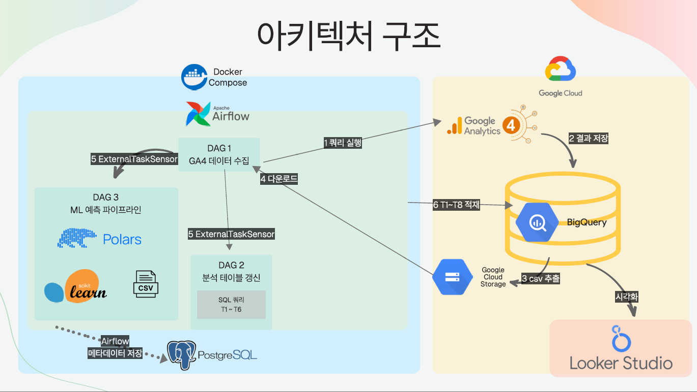

# Catch-N-Match

### 1. 프로젝트 개요

GA4 이벤트 데이터를 기반으로 사용자 행동을 분석하고,
구매 확률 예측 및 이탈 가능성 예측 결과를 생성하는 데이터/ML 파이프라인 프로젝트입니다.

주요 기능은 다음과 같습니다.

GA4 raw 데이터 적재 및 테이블 분리

사용자 단위 feature 생성

구매 예측 / 이탈 예측 모델 학습 및 추론

예측 결과 CSV 생성

대시보드 시각화 연동

### 2. 디렉토리 구조
```
CATCH-N-MATCH/
├── credentials/
├── data/
│   └── raw/
│       └── raw_data_with_gmt.csv
├── docker/
│   ├── dags/
│   │   ├── daily_bq_update.py
│   │   ├── daily_ga4_ingestion.py
│   │   └── daily_ml_pipeline.py
│   ├── logs/
│   ├── compose.yml
│   ├── Dockerfile.python
│   └── requirements.txt
├── output/
│   ├── t7_prediction_result.csv
│   └── t8_prediction_trend.csv
├── src/
│   └── ML/
│       ├── models/
│       │   ├── purchase_model.pkl
│       │   └── churn_model.pkl
│       └── ml_predict.py
├── .env.example
└── .gitignore
```
### 3. 실행 환경

Docker

Docker Compose

Python 3.11

Airflow

LogisticRegression / XGBoost / Scikit-learn / Polars

### 4. Docker 컨테이너 실행
4-1. 컨테이너 빌드 및 실행
docker compose -f docker/compose.yml up -d --build
4-2. 컨테이너 상태 확인
docker ps
### 5. ML 추론 실행 방법

구매 예측 결과를 생성하려면 아래 명령어를 실행합니다.

docker exec -it airflow-scheduler bash -lc \
"INPUT_DATA_PATH=/app/data/raw/raw_data_with_gmt.csv \
OUTPUT_DIR=/app/output \
python /app/src/ML/ml_predict.py"

### 6. 출력 결과 확인

추론 실행 후 /app/output 경로에 결과 파일이 생성됩니다.

생성 파일

t7_prediction_result.csv

t8_prediction_trend.csv

컨테이너 내부에서 확인
docker exec -it airflow-scheduler bash -lc "ls -al /app/output"
결과 파일 미리보기
docker exec -it airflow-scheduler bash -lc "head -n 5 /app/output/t7_prediction_result.csv"

### 7. 데이터 파일 확인

원본 데이터 파일이 정상적으로 마운트되었는지 확인합니다.

docker exec -it airflow-scheduler bash -lc "ls /app/data/raw"

정상적으로 마운트되면 아래 파일이 보여야 합니다.

raw_data_with_gmt.csv

### 8. 모델 파일 확인

추론에 필요한 모델 파일이 정상적으로 존재하는지 확인합니다.

docker exec -it airflow-scheduler bash -lc "ls -al /app/src/ML/models"

### 9. Airflow

Airflow는 배치 파이프라인 실행 및 스케줄링을 위한 오케스트레이션 도구로 사용합니다.

현재 프로젝트에서는 다음과 같은 역할을 수행합니다.

데이터 처리 스케줄링

ML 추론 배치 실행

향후 재학습 파이프라인 확장 가능

※ 세부 DAG 구조 및 운영 로직은 프로젝트 진행 상황에 따라 추가될 수 있습니다.

---

## DAG 구조

### DAG1: `daily_ga4_ingestion`
- 스케줄: `0/10 * * * *` (10분마다, GA4 1일치 처리)
- 흐름: `compute_ga4_date` → `bq_create_raw_table` → `bq_export_to_gcs` → `download_from_gcs` → `merge_csv_files`
- 출력: BQ `raw_data_{date}` 테이블 + 로컬 `/opt/airflow/data/raw/raw_data_{date}.csv`

### DAG2: `daily_bq_update`
- 스케줄: `5/10 * * * *` (DAG1보다 5분 뒤)
- `ExternalTaskSensor`로 DAG1 `merge_csv_files` 완료 대기 (최대 2시간)
- 흐름: `wait_for_dag1` → `compute_ga4_date` → `append_to_stored_data` → T1~T6 갱신
- DAG1과 독립: DAG3 영향 없음

### DAG3: `daily_ml_pipeline`
- 스케줄: `5/10 * * * *` (DAG2와 동일)
- `ExternalTaskSensor`로 DAG1 `merge_csv_files` 완료 대기 (최대 2시간)
- 흐름: `wait_for_dag1` → `compute_ga4_date` → `prepare_ml_input` → `ml_predict` → `upload_to_gcs` → T7/T8 BQ 업로드
- DAG1과 독립: DAG2 영향 없음

---

## 날짜 시뮬레이션

| 배포 후 인터벌 | GA4 날짜 | 설명 |
|---|---|---|
| 0번째 (첫 실행) | 2021-01-17 | `AIRFLOW_DEPLOY_DATETIME` 기준 |
| 1번째 (+10분) | 2021-01-18 | |
| ... | ... | |
| 14번째 (+140분) | 2021-01-31 | 마지막 실행 |

- GA4 데이터 범위: 2021-01-17 ~ 2021-01-31 (15일)
- `end_date` = `AIRFLOW_DEPLOY_DATETIME` + 145분 (DAG2/3 기준)
- 현재 시각이 `end_date`를 초과하면 task skip → DAG success with no tasks 발생

---

## 실패 동작

| 실패 위치 | 동작 |
|---|---|
| DAG1 task 실패 | retries 없음 → 하위 task `upstream_failed` → DAG2/3 Sensor 2시간 대기 후 timeout |
| DAG2 task 실패 | DAG3 영향 없음 (독립) |
| DAG3 task 실패 | DAG2 영향 없음 (독립) |

---

## 재시작 절차

`docker compose up` 이후 시간이 지나 `end_date`가 만료되면 DAG가 실행되지 않는다.
완전 재시작 시 `.env`의 `AIRFLOW_DEPLOY_DATETIME`을 **`up -d` 직전 현재 KST 시각**으로 반드시 업데이트할 것.

```bash
# 1. 컨테이너 및 볼륨 제거
docker compose -f docker/compose.yml --env-file .env down -v

# 2. 로그 정리
sudo rm -rf docker/logs/*

# 3. .env 의 AIRFLOW_DEPLOY_DATETIME 을 현재 KST 시각으로 수정
#    예: AIRFLOW_DEPLOY_DATETIME=2026-03-08T14:30:00
vi .env

# 4. 재시작
docker compose -f docker/compose.yml --env-file .env up -d
```

> `.env`의 `AIRFLOW_DEPLOY_DATETIME` 형식: `YYYY-MM-DDTHH:MM:SS` (KST 기준)

---

## 환경 설정

`.env.example`을 복사하여 `.env` 파일 생성 후 값 입력:

```bash
cp .env.example .env
```

| 변수 | 설명 |
|---|---|
| `GCP_PROJECT_ID` | GCP 프로젝트 ID |
| `BQ_DATASET` | BigQuery 데이터셋 ID |
| `GCS_BUCKET` | GCS 버킷 이름 |
| `AIRFLOW_DEPLOY_DATETIME` | Airflow 배포 시각 (KST, `YYYY-MM-DDTHH:MM:SS`) |

GCP 서비스 계정 키 파일을 `credentials/service_account.json`에 위치시킬 것.

---

## 주요 경로

| 경로 | 설명 |
|---|---|
| `docker/dags/` | Airflow DAG 파일 |
| `docker/dags/sql/` | BigQuery SQL 파일 |
| `src/ML/ml_predict.py` | ML 예측 스크립트 |
| `src/ML/models/purchase_model.pkl` | ML 모델 |
| `data/raw/` | 로컬 raw CSV 파일 |
| `output/` | ML 예측 결과 CSV |
| `credentials/` | GCP 서비스 계정 키 (gitignore) |


### 10. Looker Studio

Looker Studio는 예측 결과 및 집계 결과를 시각화하는 용도로 사용합니다.

활용 예시:

예측 구매자 수

구매 확률 분포

일자별 예측 추이

사용자 세그먼트 요약

※ 상세 대시보드 설정은 별도 시각화 문서 또는 공유 링크 기준으로 관리합니다.

### 11. 주의사항

raw_data_with_gmt.csv 파일이 /app/data/raw/ 경로에 있어야 합니다.

모델 파일(purchase_model.pkl 등)이 /app/src/ML/models/ 경로에 있어야 합니다.

대용량 데이터 실행 시 WSL / Docker 환경에서 메모리 사용량이 높아질 수 있습니다.

### 12. 문제 해결
output 파일이 생성되지 않는 경우

데이터 파일 존재 여부 확인

docker exec -it airflow-scheduler bash -lc "ls /app/data/raw"

모델 파일 존재 여부 확인

docker exec -it airflow-scheduler bash -lc "ls -al /app/src/ML/models"

추론 스크립트 직접 실행

docker exec -it airflow-scheduler bash -lc \
"INPUT_DATA_PATH=/app/data/raw/raw_data_with_gmt.csv \
OUTPUT_DIR=/app/output \
python -u /app/src/ML/ml_predict.py"

### 13. 실행화면 & 시연영상
시연영상<br>


구매모델 학습<br>
<br>

구매모델 성능<br>
<br>

구매전환율<br>
<br>


퍼널분석<br>
<br>

일별세션 매출, 전환율<br>
<br>

polars 전처리시 메모리 변화와 시간 소모<br>
<br>

MLflow 로깅<br>
<br>
MLflow 실험관리<br>
<br>


### 14. DataFlow
